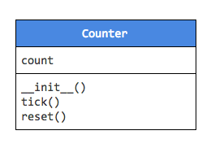

# C4T Advanced
## Bài test kiểm tra trình độ đầu vào

1. Viết một chương trình cho phép người dùng nhập vào hai số, tính tổng của 2 số này rồi in ra

2. Viết một chương trình cho phép người dùng nhập vào một năm (ví dụ 1989) kiểm tra và in ra xem năm người dùng nhập vào có phải năm nhuận không

Chú ý: Để cho đơn giản, xét năm nhuận bằng một điều kiện là năm này có chia hết cho 4 hay không

3. Viết một chương trình cho phép người dùng nhập vào một số và đếm số chữ số của số mà người dùng nhập vào. Ví dụ: Người dùng nhập vào 34823, chương trình sẽ tính và in ra được là số này có 5 chữ số

4. Viết chương trình in ra 1 dãy số từ 1 đến 20

5. Viết chương trình in ra 1 dãy số từ 1 đến 20, chỉ bao gồm các số chia hết cho 3

6. Viết một chương trình cho phép người dùng thêm 1 số vào cuối 1 dãy số đã có.

```
Hi there, this is our sequence:
1, 5, -9, 3
What do you you want to add: -99
This is our new sequence:
1, 5, -9, 3, -99
```

7. Viết một chương trình cho phép người dùng thêm 1 số vào đầu 1 dãy số đã có.

```
Hi there, this is our sequence:
1, 5, -9, 3
What do you you want to add: -99
This is our new sequence:
-99, 1, 5, -9, 3
```

8. Viết một chương trình cho phép người dùng xóa 1 số trong 1 dãy số đã có ở vị trí đầu hoặc cuối

```
Hi there, this is our sequence:
1, 5, -9, 3
Where do you want to delete (head/tail): head
This is our new sequence:
5, -9, 3
```

```
Hi there, this is our sequence:
1, 5, -9, 3
Where do you want to delete (head/tail): tail
This is our new sequence:
1, 5, -9
```

9. Viết một hàm tên là `quadro` (phương trình bậc hai), nhận vào 3 số `a`, `b`, `c` là 3 hệ số của một phương trình bậc hai (`ax^2 + bx + c`) và trả về nghiệm của phương trình bậc hai này.

Chú ý 1: Người thực hiện có thể thử không viết hàm trước, tuy nhiên câu này chỉ được tính khi **hàm quadro được viết hoàn chỉnh và được kiểm tra**

_Chú ý 2: nếu đã biết khai báo và dùng hàm ở ngôn ngữ khác mà chưa biết thực hiện những việc này ở trong Python, tham khảo các tài liệu sau:_

Tiếng Anh:
[How to think like computer scientist - Python 3](http://openbookproject.net/thinkcs/python/english3e/functions.html)

Tiếng Việt:
[Hàm trong python](https://toidicode.com/ham-trong-python-352.html)

10. Viết một class có tên là `Counter`, có 1 thuộc tính (property) là `count` và hai phương thức là `tick()` và `reset()`



Viết hàm khởi tạo (__init__) cho class này, trong hàm khởi tạo, cho `count` = 0

Viết hàm `tick()`, mỗi khi `tick()` được gọi, tặng `count` lên 1

Viết hàm `reset()`, mỗi khi `reset()` được gọi, đưa `count` về 0

_Chú ý: Nếu chưa biết về class và object của python, tham khảo các tài liệu sau:_

Tiếng Anh
[Class in python - basics](http://openbookproject.net/thinkcs/python/english3e/classes_and_objects_I.html)

Tiếng Việt
[Class trong Python](https://toidicode.com/class-va-cach-khai-bao-class-trong-python-357.html)

11. Viết các chương trình sau, sử dụng đệ quy
- Tìm số bé nhất trong 1 dãy số
- Tính giai thừa của 1 số nhập bởi người dùng
- Tính một số trong dãy fibbonacii `f(n) = f(n - 1) + f(n - 2)` và `f(0) = 1`, với `n` nhập từ người dùng
- Tìm ước số chung lớn nhất của 2 số bằng phương pháp Euclid, Link tham khảo:
  - Tiếng anh:
    - [Wiki](https://en.wikipedia.org/wiki/Euclidean_algorithm),
    - [Youtube video](https://www.youtube.com/watch?v=B0NtAFf4bvU)
  - Tiếng Việt
    - [Wiki](https://vi.wikipedia.org/wiki/%C6%AF%E1%BB%9Bc_s%E1%BB%91_chung_l%E1%BB%9Bn_nh%E1%BA%A5t)
- Đảo chiều 1 dãy (số hoặc chữ)
